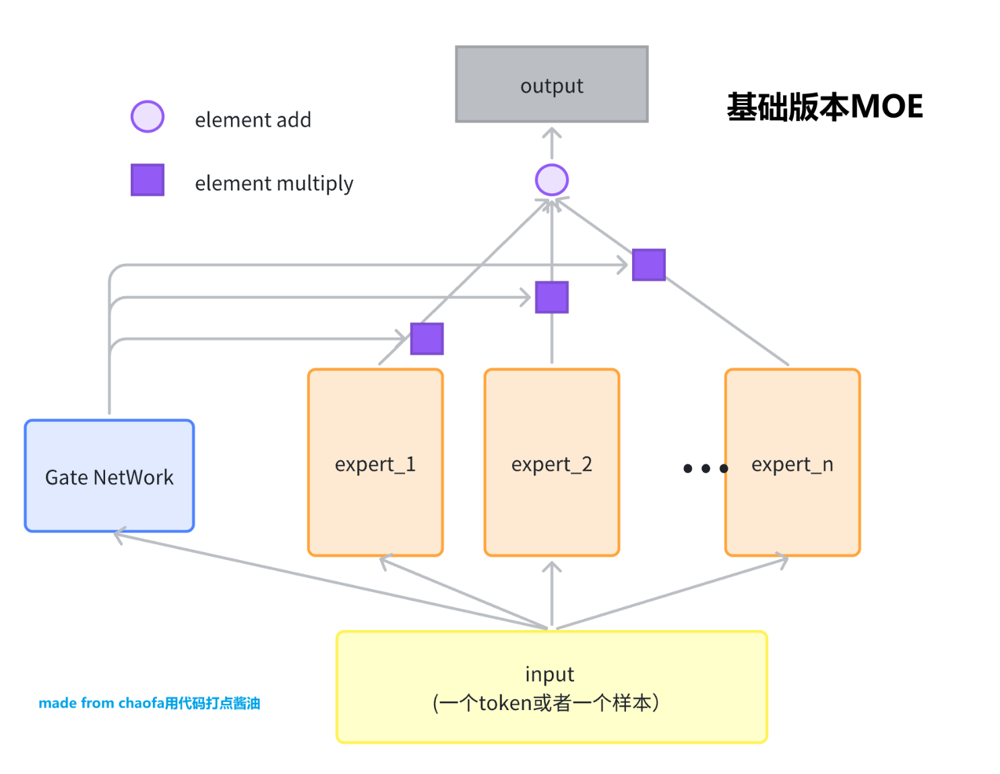
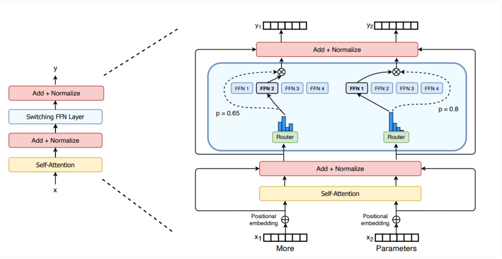
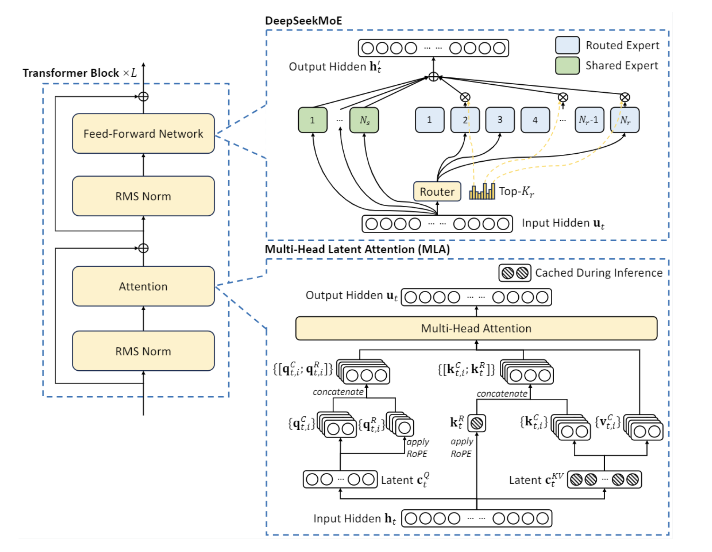

## MOE 大全

### 1.MoE基础版

​	基础版为最简单的线性映射，把每一个不同的映射当成不同的专家，再予以不同的权重进行加权，得到最终的输出

### 2.Sparse MoE 

​	稀疏MoE为每一个输入的tokens都使用不同的专家进行甲醛，专家选择则是基于softmax得到概率的Top_k结果。然后对Top_k的专家概率归一化，加权得到最后输出的结果

#### 2.2代码思路流程

1. 首先把输入X变换成(batch * seq,hidden_dim)格式，然后输入到routermoe进行变换
2. 在routermoe中，对输入x通过专家层之后得到不同的概率，然后softmax得到Top_k个专家的矩阵和其mask
3. 对top_k个专家概率归一化，并对mask进行one_hot ，将shape变为(expert_num,top_k,batch * seq )，将值返回。
4. 建立Sparse Moe，定义专家list和routermoe
5. 创建新的final全零矩阵，然后遍历不同的experts
6. 对每个experts矩阵进行where操作获取其mask下非零的横、纵坐标，方便于后续操作
7. 获取当前专家下，被topk选中的tokens的data数组，并通过expert_layer。
8. 获取对应tokens数组的weight。在上面返回了select_weight矩阵，对select_weight[tokens_id,topk].unsqueeze(-1)即可获取其值。其shape为(select_tokens,1)
9. data和weight相乘，得到最终结果
10. 通过index_add_加入到最终的final矩阵当中，最后对这个final矩阵进行shape变换为原来x的shape即完成

#### 2.torch.Stack

​	torch.stack()相比于torch.concat，Stack会增加维度，而concat只是在维度上做了个拼接，不会增加维度。

### 3.DeepSeek Moe

​	相比于Sparse Moe，多了个共享专家列表，这些共享专家固定参与x的计算，然后在route_experts中使用topk的结果与share_experts的结果进行相加，得到最终的输出。

### QA

#### 1.为什么Top_k可以被反向传播

​	反向传播的是传递Top_k参数的当前expert的概率，而非Top_k本身。其是离散值，不可微。通过softmax获得的概率值进行反向传播，可以得到Top_k的值。从而达到反向传播的效果
