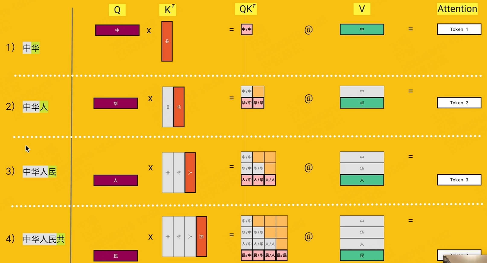
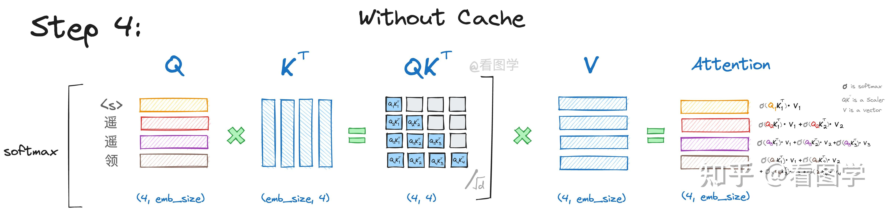
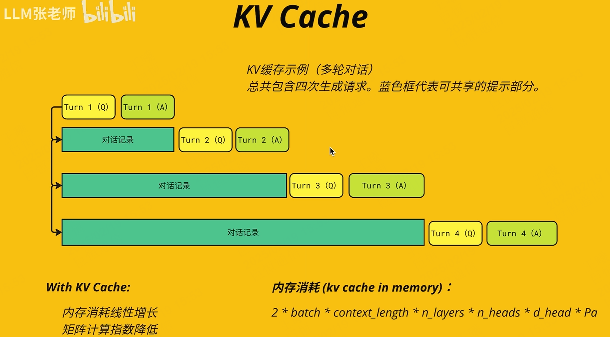
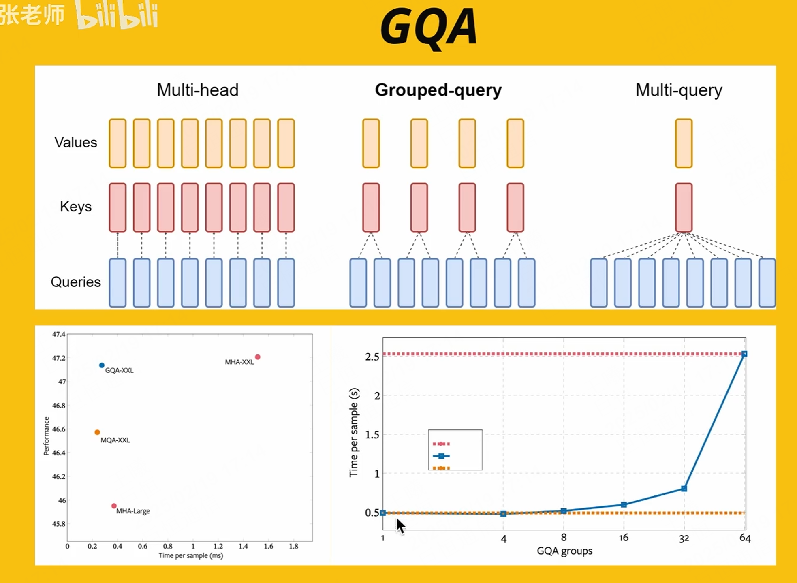
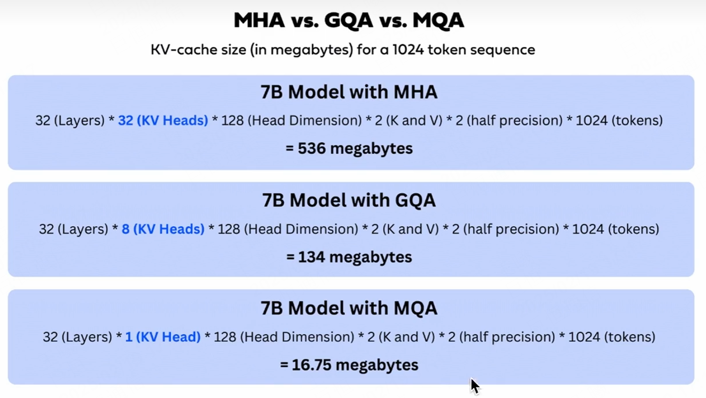
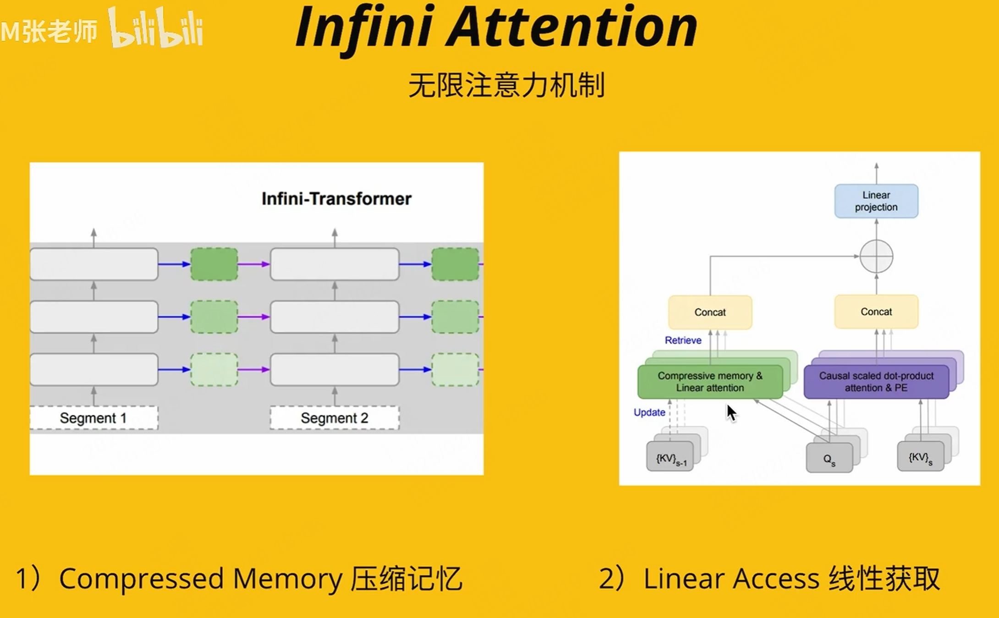
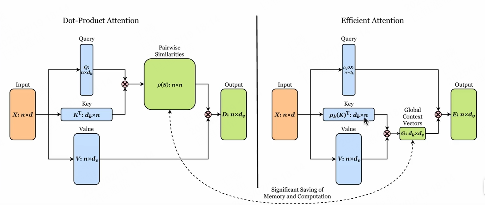
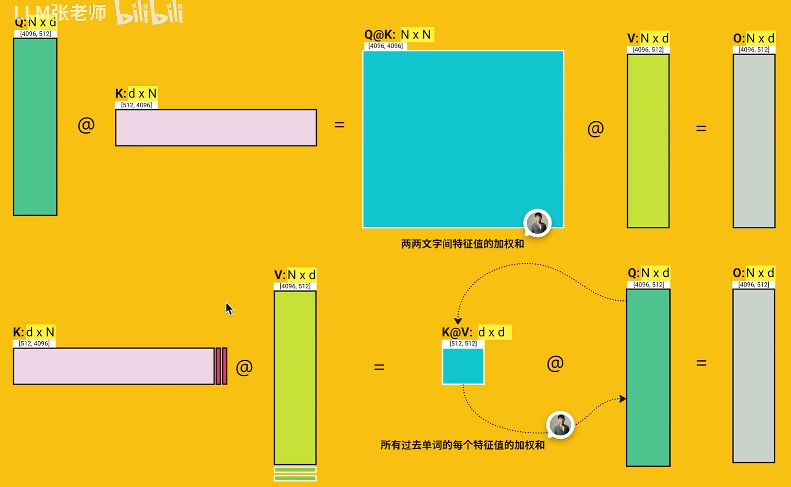
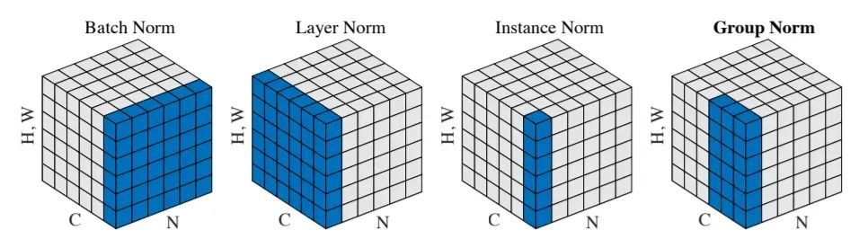

## 大模型知识杂烩

### 1.KV cache

 	kvcache用于加速计算attention，对于之前已经计算过的QK值进行屏蔽，**只对新预测出来的值进行KV计算**，减少矩阵的运算量。（图源b站@llm张老师）

​	


​	对之前的KV矩阵进行缓存，这样就无需重新计算之前已经计算过的矩阵，直接把新矩阵加入即可


$$
\$$
\begin{aligned}
    \textcolor{orange}{Att_1}(Q, K, V) &= \text{softmaxed}(\textcolor{orange}{Q_1} K_1^T) \vec{V}_1 \\
    \textcolor{red}{Att_2}(Q, K, V) &= \text{softmaxed}(\textcolor{red}{Q_2} K_1^T) \vec{V}_1 + \text{softmaxed}(\textcolor{red}{Q_2} K_2^T) \vec{V}_2 \\
    \textcolor{purple}{Att_3}(Q, K, V) &= \text{softmaxed}(\textcolor{purple}{Q_3} K_1^T) \vec{V}_1 + \text{softmaxed}(\textcolor{purple}{Q_3} K_2^T) \vec{V}_2 + \text{softmaxed}(\textcolor{purple}{Q_3} K_3^T) \vec{V}_3 \\
    \textcolor{red}{Att_4}(Q, K, V) &= \text{softmaxed}(\textcolor{red}{Q_4} K_1^T) \vec{V}_1 + \text{softmaxed}(\textcolor{red}{Q_4} K_2^T) \vec{V}_2 + \text{softmaxed}(\textcolor{red}{Q_4} K_3^T) \vec{V}_3 \\
    &\quad + \text{softmaxed}(\textcolor{red}{Q_4} K_4^T) \vec{V}_4
\end{aligned}
\$$
$$
​	前面输入对话框的内容也会在新对话时，重新输入进Transformer里面，这样才有了上下文关联。所以这会导致输入的数据越来越大，以前的处理方式为：以最新内容为长度4096，截断以前的对话内容。有了KV Cache之后可以大量减少内存消耗，扩大上下文关联度



### 2. MHA、MQA、GQA

​	MHA为一个Query对应一个K、V

​	MQA为一群Query对应一个K、V

​	GQA为几个Query对应一个K、V

​	GQA相当于存储器里面的组相连




​	不同QKV匹配下的不同计算参数，单一链接速度最快，但是精度最低，而组相连精度与全相联差不多，但是时间少了将近四倍



### 2.Sparse Attention 和 Infine Attention

#### 2.1 Sparse  Attention

​	稀疏注意力对==**QK**==矩阵进行了优化。

- 首先对矩阵进行随机关注
- 然后进行对角线关注。这样突出的是相邻两个词的关注度，因为在相邻的两个词之间相关性最高
- 其次对句子的第一、第二个词进行全文的关注
- 最后将其拼接，构成稀疏关注度矩阵


#### 2.2 Infine Attention

- 在Segmengt1输入一段tokens，然后对其**输出的KV矩阵进行缓存**。
- 然后在Segment2中再输入一段tokens，计算出自己的KV与Q的值，并缓存KV矩阵。
- 与上一层的KV矩阵进行Concat，再经过一个linear层（估计最后还会变回KV相同维度的矩阵大小用于下一次使用）



​	KV压缩矩阵就是把原来QK相乘的步骤改为先KV。QK矩阵锁表示的是上下文词之间的语音关系，而KV表示的是语音特征向量的之间关系的矩阵，他的矩阵维度相比QK要小的很多。





### 3.归一化

Batch_Norm为对一批的数据进行归一化

Layer_Norm为对所有batch的特征进行归一化



### 4.大模型Prompt格式

#### 📌 `apply_chat_template()` 作用  

它的作用是**将聊天记录转换为模型所需的 prompt 格式**，不同的模型格式不同，比如：  

#### 🔹 LLaMA2 格式  

```markdown
<|system|>
You are a helpful assistant.

<|user|>
What is the capital of France?

<|assistant|>
The capital of France is Paris.

<|user|>
How about Germany?
```

#### 🔹 OpenChat / ChatML 格式  

~~~markd
<|im_start|>system
You are a helpful assistant.<|im_end|>

<|im_start|>user
What is the capital of France?<|im_end|>

<|im_start|>assistant
The capital of France is Paris.<|im_end|>

<|im_start|>user
How about Germany?<|im_end|>
~~~


